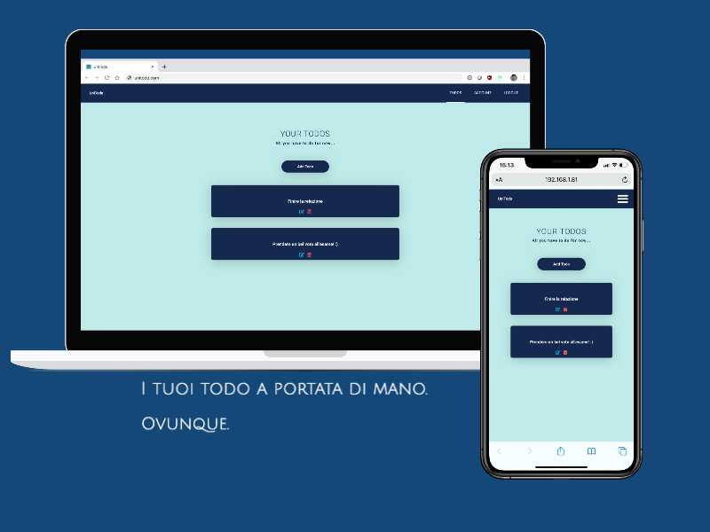

# UniTodo 

<p align="center">
  
  <br>
  
  
  
  <br>
  <br>
  Sviluppato per il corso dell'Università di Camerino di Applicazioni Web e Mobile.
  <br>
  <a href="https://luca-fuligni.github.io/UniTodo"> •Sito Web• </a>
  <br>
  
</p>

## Tabella dei contenuti
1. [Introduzione](#introduzione)
2. [Tecnologie utilizzate](#tecnologie-utilizzate)
3. [Librerie utilizzate](#librerie-utilizzate)
4. [Sicurezza e configurazione DB](#sicurezza-e-configurazione-db)
5. [Utilizzo](#utilizzo)
6. [Performance](#performance)
6. [Autori](#autori)

## Introduzione



L'idea alla base del progetto è quella di realizzare una semplice todo-list in modalità single-page. 
Inizialmente l'utente sarà in grado di registrarsi all'applicazione inserendo nome, cognome, e-mail e password. Nel caso non sia già registrato, l'utente riceverà una mail di conferma all'indirizzo specificato. Per proseguire nella creazione di todo dovrà obbligatoriamente procedere con la verifica.
A questo punto, l'utente potrà creare, modificare ed eliminare i propri todo. Inoltre, avrà una completa gestione del proprio profilo.
Assieme alla possibilità di eseguire il login e logout, è stata fornita la possibilità di recuperare la propria password in caso di smarrimento.

## Tecnologie utilizzate
Il punto focale del progetto è stato in particolar modo lo sviluppo del frontend. Per la stesura dell'intero lavoro sono state utilizzate quattro tecnologie principali.

### React
React è una libreria Javascript open source, usata per costruire interfacce utente. Sviluppata da Facebook, è stata utilizzata per la realizzazione del news feed all'interno del social network e per costruire la versione web di Instagram.

Generalmente, React semplifica la scrittura di applicazioni web single-page perché rende il loro sviluppo estremamente veloce.
Un altro punto favorevole di React è la tecnica del server-rendering, ovvero il fatto che consenta il rendering di ogni singolo componente direttamente sul server, inviando poi al browser il codice HTML.

### Redux
Redux è una architettura utilizzata per scrivere applicazioni web. Dopo essere nata principalmente per React, si è aperta ad altri framework quali Angular e Vue.js.
L'idea è quella di rendere prevedibile il cambio di stato tramite restrizioni su come e quando avviene lo stesso.
Negli ultimi anni Redux si è proposta come una valida alternativa al classico modello MVC.

#### Firebase e Firestore
Firebase è un servizio online fornito da Google. Il suo scopo principale è quello di proporsi come backend as a service. Permette infatti di salvare e sincronizzare i dati elaborati da applicazion i web e mobile.
Nel nostro caso, Firebase e Firestore sono stati utilizzati rispettivamente per l'autenticazione e la gestione dei dati relativi alla applicazioni in un database NoSQL.

## Librerie utilizzate
Per la scrittura dell'applicazione web sono state usate diverse librerie esterne per permettere l'interazione delle suddette tecnologie.

### Styled Components
La libreria Styled Components permette di scrivere il CSS in JavaScript rimuovendo il mapping fra componenenti e stili. Il componente è descritto tramite un costruttore apposito derivato direttamente dalla libreria, invece di iniettare il CSS ogni qual volta necessario.
Fondamentalmente tiene traccia di tutti i componenti renderizzati in un pagina e inietta il relativo styling automaticamente.

### React Redux Firebase
La libreria React Redux Firebase permette l'interoperabilità fra i tre componenti specificati nel nome stesso.

### Redux Thunk
All'interna dell'architettura Redux, Thunk funge da middleware permettondo di svolegere operazioni asincrone (nel nostro caso interagire con il DB) altrimenti non possibili.

### Formik
Formik permette di costruire più agevolmente dei form per la nostra applicazione, rendendo disponibile l'uso di diversi metodi per gestire invio e validazione.

### Yup
È una libreria JavaScript che abbiamo utilizzato per il parsing dei vari campi durante la validazione dei form.

## Sicurezza e configurazione DB
Per migliorare la sicurezza dell'applicazione e fornire solamente i privilegi indispensabili, il DB è stato configurato secondo il seguente codice:
```
rules_version = '2';
service cloud.firestore {
  match /databases/{database}/documents {
    match /todos/{userId} {
      allow read, update, delete: if request.auth.uid == userId;
      allow create
    }
    match /users/{userId} {
      allow read, update, delete: if request.auth.uid == userId;
      allow create
    }
  }
}
```

## Utilizzo
L'applicazione può essere liberamente accessibile all'URL [UniTodo](http://luca-fuligni.github.io/UniTodo).
Nel caso si volesse testare localmente basterà lanciare i seguenti comandi:

```
git clone

cd unitodo

npm install

npm start
```

L'applicazione sarà poi raggiungibile all'indirizzo ```http://localhost:3000```, utilizzato da React come percorso di default.

## Performance

<p align="center">
  
</p>


## Autori
[Luca Fuligni](https://github.com/luca-fuligni)

[Michele Russo](https://github.com/micrus)


